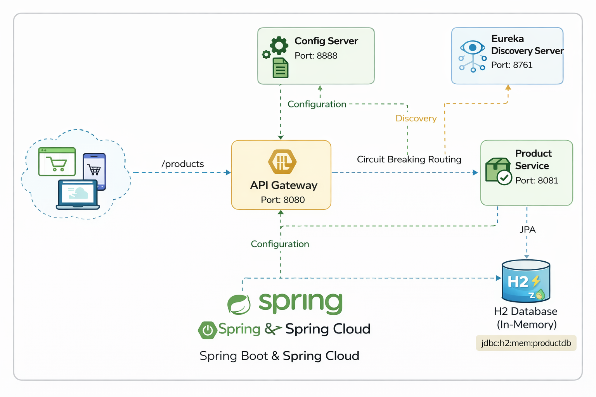

# 🛒 E-Commerce Microservices System

A production-style microservices architecture built using **Spring Boot & Spring Cloud** demonstrating service discovery, centralized configuration, and API gateway routing.

---

## 🚀 Architecture

- Config Server (Centralized configuration)
- Eureka Discovery Server (Service Registry)
- API Gateway (Routing + Load Balancing)
- Product Service (REST + Database)

---

## 🧱 Technologies Used

- Java 17
- Spring Boot
- Spring Cloud
- Eureka Discovery Server
- Spring Cloud Gateway
- Spring Config Server
- Spring Data JPA
- H2 Database
- Maven
- REST APIs

---

## 🔧 Services & Ports

| Service | Port |
|--------|------|
| Config Server | 8888 |
| Discovery Server | 8761 |
| API Gateway | 8080 |
| Product Service | 8081 |

---

## 📌 API Endpoints

### Get All Products
GET http://localhost:8080/products

### Create Product
POST http://localhost:8080/products

Body:
json
{
  "name":"MacBook",
  "description":"M3",
  "price": 1500
}

🗄 Database

In-memory H2 Database

Console: http://localhost:8081/h2-console

JDBC URL: jdbc:h2:mem:productdb

📷 Architecture Diagram
  
    ### 🔄 Request Flow
  
  1. Client sends request to API Gateway (Port 8080)
  2. Gateway uses Eureka to locate Product Service
  3. Product Service fetches configuration from Config Server
  4. Product Service interacts with H2 Database
  5. Response returned to Client via Gateway

📈 Future Improvements

  Add Order Service
  
  Add User Authentication (JWT)
  
  MySQL Integration
  
  Dockerize services
  
  OpenFeign Communication
  
  Circuit Breaker (Resilience4j)
  
👨‍💻 Author

Pardha Saradhi Chakolthi
MSc Computer Science | Microservices | Spring Boot | AWS

GitHub: https://github.com/Pardha543
